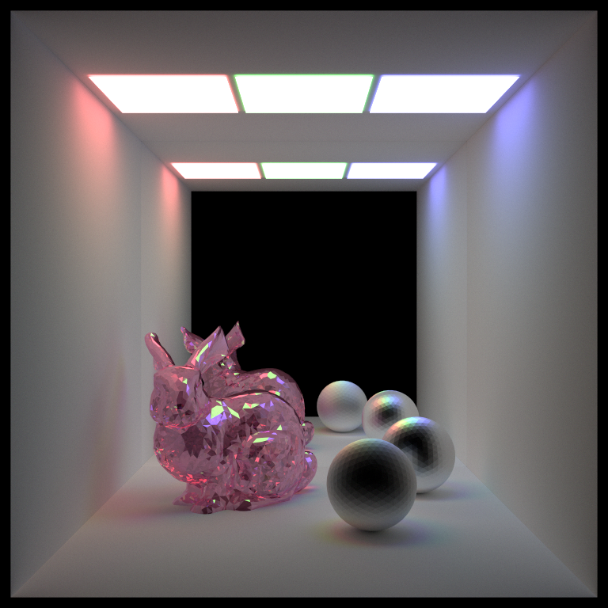

# Remote Rendering for XR

  

**Team members:**
- Gizem Dal
  - [Portfolio](https://www.gizemdal.com/), [Linkedin](https://www.linkedin.com/in/gizemdal/)
- Dayu Li
- Tushar Purang
  - [Portfolio](https://tushvr.com/), [Linkedin](https://www.linkedin.com/in/tpurang/)

#### Table of Contents  
[Project Description](#description)  
[Setup Overview](#overview)  
[OptiX Ray Tracer](#ray-tracer)   
[OBJ & MTL Parsing](#obj-mtl-parsing)
[Streaming & Network](#streaming)  
[Resources](#resources)  

<a name="description"/> 

## Project Description

The goal of our project is to use the power of GPU rendering to get real-time path tracing results of scenes, pass the render frames from device to host memory to make it accessible by a server Unity Desktop Application and then send these frames to be viewed through XR platforms such as Microsoft Hololens or Android devices. Real time ray tracing on mixed reality platforms is still an open research problem today and we're very excited to have this opportunity to experiment with this field and share our results.

In order to achieve real-time path tracing on the GPU, we're using the [NVIDIA OptiX Ray Tracing Engine (Version 7.2.0)](https://developer.nvidia.com/optix) which is designed to accelerate ray tracing applications on NVIDIA GPUs and allow users to program intersection, ray generation and shading components.

<a name="overview"/>

## Setup Overview

These instructions should help you with running the OptiX Path Tracer sample on Windows.
- Step 1: Download the NVIDIA OptiX 7.2.0 SDK. This will also require a NVIDIA Driver of version 456.71 or newer.
- Step 2: Once you download the OptiX SDK, clone our project and cd to the optix_sdk_7_2_0/SDK folder.
- Step 3: Create a new folder named 'data' and create a subfolder named 'Sponza' inside. Download the [Crytek Sponza](https://casual-effects.com/data/) mesh and put all the files inside the new Sponza folder.
- Step 4: Go back to the SDK parent folder. Create a build directory and cd into it. Run cmake to configure and generate the VS solution.   
- Step 5: Once you have the VS solution ready, open it and set optixPathTracer as the start up project.
- Step 6: Build the project in Release mode and hit 'Ctrl + F5' to run. You should see an interactive popup window with Sponza rendered with different colors per material.
	- Use the left mouse button to change camera orientation, middle mouse button to zoom in/out and right mouse button to pan the camera.
	- Press 'S' on the keyboard to save the current render frame. The render frame will be saved as 'output.png' under SDK/build/optixPathTracer. This file will be overwritten by the next saved frame unless you change its name!

<a name="ray-tracer"/>

## OptiX Ray Tracer

We are using the [NVIDIA OptiX 7.2.0](https://developer.nvidia.com/optix) real-time ray tracing engine for our GPU rendering and benefiting from OptiX acceleration structures to get fast results while rendering scenes with complex meshes.
We downloaded the [OptiX 7.2.0 samples](https://developer.nvidia.com/designworks/optix/download) for Windows and started our implementation from the optixPathTracer sample. The initial state of the sample had the triangle geometry acceleration structure and the basic ray tracing programs ready; however it only supported hardcoded scene data with single area light and only diffuse material support.
We enhanced this path tracer to handle different types of scene geometry (cube, icosphere and arbitrary meshes), materials (diffuse, perfect specular, imperfect specular, fresnel dielectric) and light sources (area, point and spot light). We also added support for multiple light sources per scene. Another adjustment we made to base implementation is adding Russian Roulette termination for ray paths that have less contribution to the results.

The following render examples use the [Stanford Bunny](https://casual-effects.com/data/) arbitrary mesh in the scenes. We use the [tinyobjloader](https://github.com/tinyobjloader/tinyobjloader) to import arbitary meshes into our scenes. More detail on how we're using this library will be provided in the next section.

Area Lights | Point Lights| Spot Lights
:---: | :---: | :---: 
 |  | 

<a name="obj-mtl-parsing"/>

## OBJ & MTL Parsing

<a name="streaming"/>

## Streaming & Network

For each frame cycle, the frame buffer is dumped into an image file on device memory. This frame is read by the desktop server application and sent to the Hololens application. Networking is done using Unity's UNet. 

| Server-Client Frame Streaming  (Running on same Machine) | Raytracer to Android Frame streaming (Running on different Machines) |
| :----------------------------------------------------------: | :----------------------------------------------------------: |
|  |  |

<a name="resources"/>

## Resources

These resources helped us brainstorm ideas and implement our project. We also included third party libraries that we used for this project.

- [NVIDIA OptiX 7.2.0 SDK & Samples](https://developer.nvidia.com/optix)
- [NVIDIA OptiX 7 SIGGRAPH Course Samples by Ingo Wald](https://gitlab.com/ingowald/optix7course)
- [McGuire Computer Graphics Archive Meshes](https://casual-effects.com/data/)
- [tinyobjloader](https://github.com/tinyobjloader/tinyobjloader)
- [Physically Based Rendering: From Theory to Implementation Online Textbook](http://www.pbr-book.org/)
- [About Azure Remote Rendering](https://docs.microsoft.com/en-us/azure/remote-rendering/overview/about)
- [High-Quality Real-Time Global Illumination in Augmented Reality](https://www.ims.tuwien.ac.at/projects/rayengine)
- [A Streaming-Based Solution for Remote Visualization of 3D Graphics on Mobile Devices](https://www.researchgate.net/publication/3411346_A_Streaming-Based_Solution_for_Remote_Visualization_of_3D_Graphics_on_Mobile_Devices)
