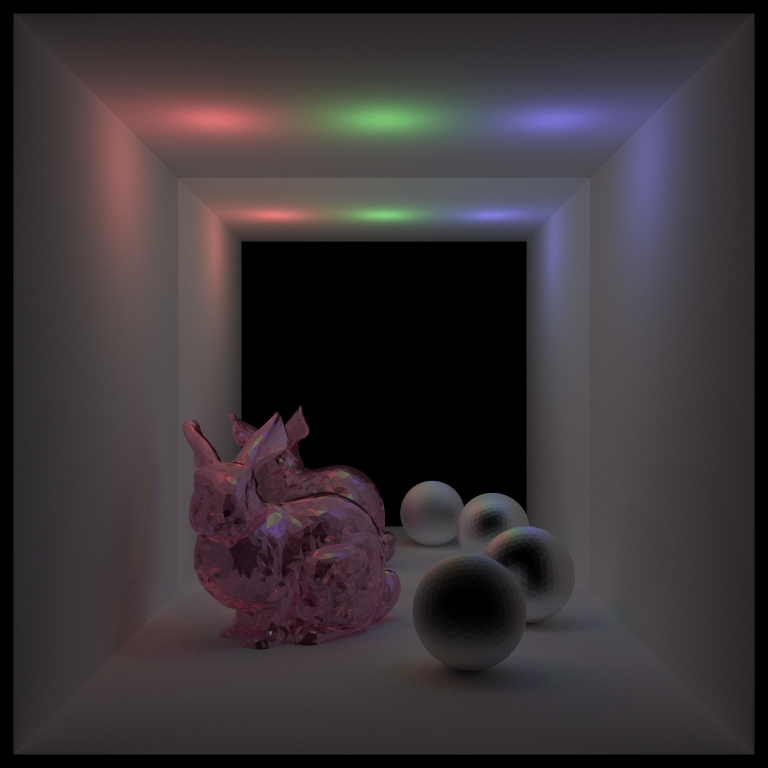
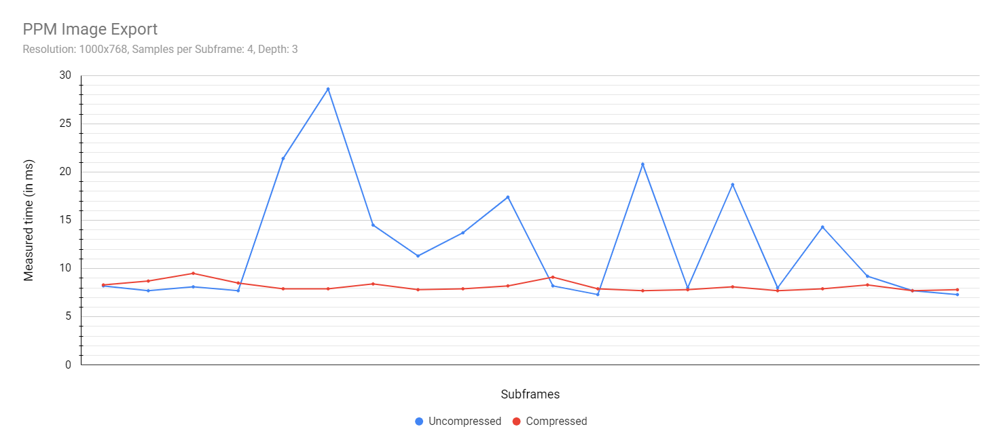
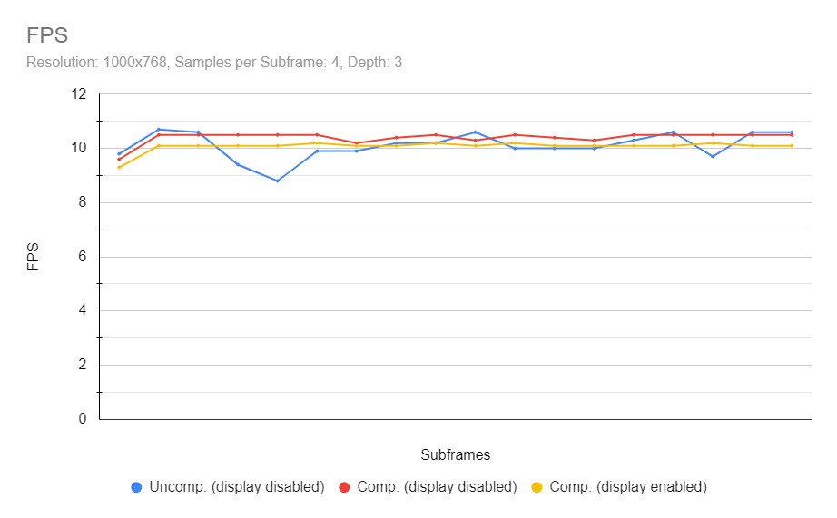
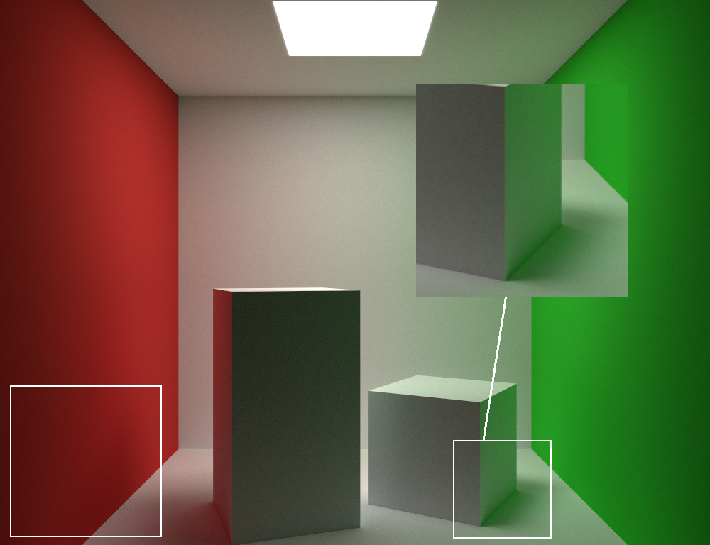
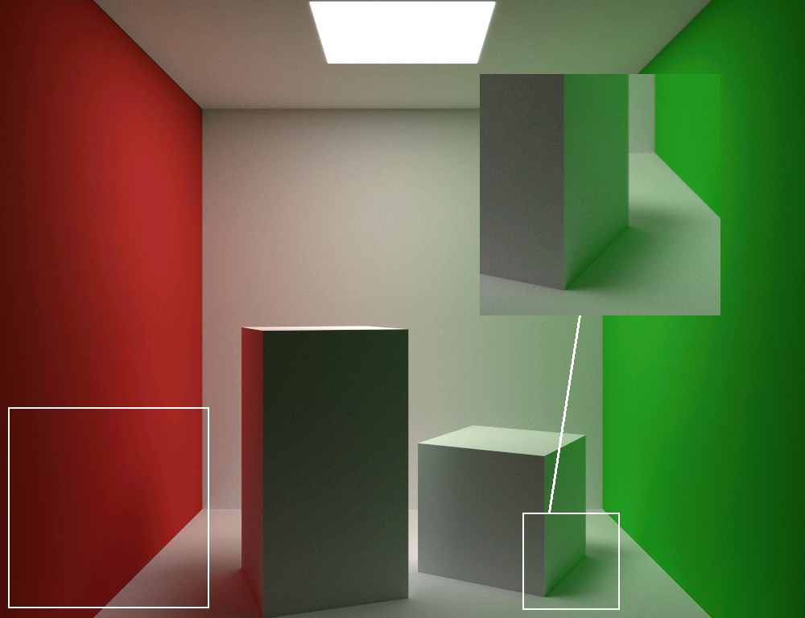
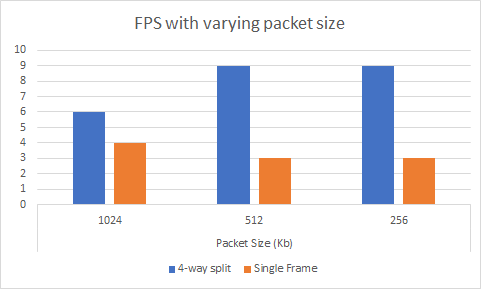

# Remote Rendering for XR  ([Demo](https://www.youtube.com/watch?v=sQsjaNrqbzM&ab_channel=Tushar))


*The dragon and sponza meshes are downloaded from [McGuire Computer Graphics Archive Meshes](https://casual-effects.com/data/)*

  

**Team members:**

- Gizem Dal
  - [Portfolio](https://www.gizemdal.com/), [Linkedin](https://www.linkedin.com/in/gizemdal/)
- Dayu Li
  - [Linkedin](https://www.linkedin.com/in/dayu95/)
- Tushar Purang
  - [Portfolio](https://tushvr.com/), [Linkedin](https://www.linkedin.com/in/tpurang/)

#### Table of Contents  
[Project Description](#description)  
[Setup Overview](#overview)  
[OptiX Ray Tracer](#ray-tracer)   
[OBJ & MTL Parsing](#obj-mtl-parsing)   
[Streaming & Network](#streaming)   
[Performance Analysis](#performance)  
[Resources](#resources)  

<a name="description"/> 

## Project Description

The goal of our project is to use the power of GPU rendering to get real-time path tracing results of scenes, pass the render frames from device to host memory to make it accessible by a server Unity Desktop Application and then send these frames to be viewed through XR platforms such as Microsoft Hololens or Android devices. Real time ray tracing on mixed reality platforms is still an open research problem today and we're very excited to have this opportunity to experiment with this field and share our results.

In order to achieve real-time path tracing on the GPU, we're using the [NVIDIA OptiX Ray Tracing Engine (Version 7.2.0)](https://developer.nvidia.com/optix) which is designed to accelerate ray tracing applications on NVIDIA GPUs and allow users to program intersection, ray generation and shading components.


<a name="overview"/>

## Setup Overview

These instructions should help you with running the OptiX Path Tracer sample on Windows.
- Step 1: Download the NVIDIA OptiX 7.2.0 SDK. This will also require a NVIDIA Driver of version 456.71 or newer.
- Step 2: Once you download the OptiX SDK, clone our project and cd to the optix_sdk_7_2_0/SDK folder.
- Step 3: Create a new folder named 'data' and create a subfolder named 'Sponza' inside. Download the [Crytek Sponza](https://casual-effects.com/data/) mesh and put all the files inside the new Sponza folder.
- Step 4: Go back to the SDK parent folder. Create a build directory and cd into it. Run cmake to configure and generate the VS solution.
	- You may have to set the GLM directory manually while configuring the project. GLM headers are included in ```optix_sdk_7_2_0/SDK/support/glm```.
- Step 5: Once you have the VS solution ready, open it and set optixPathTracer as the start up project.
- Step 6: Set build mode to Release and open Properties->Debugging. Set ```--scene ../../../../scenes/scene_example.txt``` as the command line argument. We use the --scene flag to let the program know that we're passing a scene file path.
	- You may also test the simple Cornell Box scene at ```../../../../scenes/basic_cornell.txt```
- Step 7: Build the project in Release mode and hit 'Ctrl + F5' to run. If you have loaded scene_example.txt, you should see an interactive popup window with Sponza rendered with different colors per material.
	- Use the left mouse button to change camera orientation, middle mouse button to zoom in/out and right mouse button to pan the camera.
	- Press 'S' on the keyboard to save the current render frame. The render frame will be saved as 'output.png' under SDK/build/optixPathTracer. This file will be overwritten by the next saved frame unless you change its name!

<a name="ray-tracer"/>

## OptiX Ray Tracer

We are using the [NVIDIA OptiX 7.2.0](https://developer.nvidia.com/optix) real-time ray tracing engine for our GPU rendering and benefiting from OptiX acceleration structures to get fast results while rendering scenes with complex meshes.
We downloaded the [OptiX 7.2.0 samples](https://developer.nvidia.com/designworks/optix/download) for Windows and started our implementation from the optixPathTracer sample. The initial state of the sample had the triangle geometry acceleration structure and the basic ray tracing programs ready; however it only supported hardcoded scene data with single area light and only diffuse material support.
We enhanced this path tracer to handle different types of scene geometry (cube, icosphere and arbitrary meshes), materials (diffuse, perfect specular, imperfect specular, fresnel dielectric) and light sources (area, point and spot light). We also added support for multiple light sources per scene. Another adjustment we made to base implementation is adding Russian Roulette termination for ray paths that have less contribution to the results.

The following render examples use the [Stanford Bunny](https://casual-effects.com/data/) arbitrary mesh in the scenes. We use the [tinyobjloader](https://github.com/tinyobjloader/tinyobjloader) to import arbitary meshes into our scenes. More detail on how we're using this library will be provided in the next section.

Area Lights | Point Lights| Spot Lights
:---: | :---: | :---: 
 |  | 

#### Scene Files

Scene files are passed as command line arguments with the "--scene" flag at front. For example; you can load the scene_example.txt test scene in this repository with the following command line argument: ```--scene ../../../../scene_example.txt```

There are 3 types of scene objects that you can add to the scene: CAMERA, MATERIAL and GEOMETRY. Every scene file must add a camera, if there are multiple camera items in the file only the first camera will be set as scene camera. All materials must be added before geometry!

Every material add must follow this argument pattern: ```MATERIAL (material type) (diffuse color) (specular color) (emissive color) (specular exponent) (ior)```

Every geometry add must follow this argument pattern: ```GEOMETRY (geometry type) (material id - this is the order the material is added, ordering starts from id 0) (translate vector) (rotate vector) (scale vector) (obj filepath)```

Every camera add must follow this argument pattern: ```CAMERA (render width) (render height) (eye vector) (lookat vector) (up vector) (fovy)```

<a name="obj-mtl-parsing"/>

## Import Meshes & Texture Mapping


To achieve our goal of rendering assets and objects remotely, the ray tracer should have the ability to render arbitrary meshes and import external mesh files. We used a 3rd party tool called [tiny_obj loader](https://github.com/tinyobjloader/tinyobjloader) to achieve the import of external .obj files as multiple triangles. The imported mesh can be set as any material types saved in the pathtracer. Furthermore, we would like to let the Hololens users see not only meshes in simple materials but also objects that looks real. Thus we added the features of texture mapping. The mtl loader takes the .mtl files that are usually provided along with the .obj files, it reads the pieces with same material types and let the path tracer render them as independent pieces. Then the texture loader will load the texture images and transfer them into texture objects in Optix.

The following images shows how the imported obj mesh looks like with only obj, obj and mtl, and obj,mtl,textures.

| Obj Loader | Mtl Loader | Texture Loader|
| :----------------------------------------------------------: | :----------------------------------------------------------: | :----------------------------------------------------------: |
|  |  |  |

*The sponza mesh and textures are downloaded from [McGuire Computer Graphics Archive Meshes](https://casual-effects.com/data/), shield mesh and textures are downloaded from [Turbo Squid](https://www.turbosquid.com/Search/3D-Models/free/textured)*


<a name="streaming"/>

## Streaming Frames

For each frame cycle, the frame buffer is dumped into an image file on device memory. This frame is read by the desktop server application and sent to the HoloLens 2 application. Networking is done using Unity's UNet. 


| Milestone 1: Server-Client Frame Streaming <br />(Running on same Machine) | Milestone 2: Raytracer to Android Frame streaming<br />(Running on different Machines) | Milestone 3: Desktop Server to Hololens 2                    |
| :----------------------------------------------------------: | :----------------------------------------------------------: | ------------------------------------------------------------ |
|  |  |  |


|                                                            |                                                            |
| ---------------------------------------------------------- | ---------------------------------------------------------- |
|  |  |

<a name="performance"/>

### Camera Synchronization

Based on the file I/O system, the raytracer can read data from external files, thus provide supports for camera synchronization. Provided with the path of data file, the ray tracer can keep track of the oridentation of it's main camera in each frame and synchronize it with the data. This feature can cooperate with any forms of data recorder which outputs the data in each frame to realize the camera synchronization.


### Hololens Spatial Mapping

Hololens has strong ability in scanning and rendering the environment around the user and generate a mesh. In our project we were able to fetch the Hololens spatial mapping into our raytracer to gnereate a mesh of real-world. This provide us more potentials of XR interactions in our project. The user can scan the environment around and send the exported mesh to the server and see the raytracing result.

|                                                            |                                                            |
| ---------------------------------------------------------- | ---------------------------------------------------------- |
|  |  |

## Performance Analysis

For our performance optimization analysis, we used these machines with the following specs:
- Machine 1: Intel(R) Core(TM) i7-7700HQ CPU @ 2.80 GHz 2.81 GHz with NVIDIA GeForce GTX 1060 graphics card
- Machine 2: Windows 10, i7-10700K @ 3.80GHz 16GB, GTX 2070 8150MB (Personal laptop)
- Machine 3: Windows 10, i7-7700HQ CPU @ 2.80Ghz 2.81 GHz with NVIDIA GeForce GTX 1060Ti graphics card
### Latency Analysis


The dataflow diagram above shows the sources of the latency. In each iteration, first the state will be updated to create a subframe, in the real usage of our remote rendering project, we turned off the display of subframes so that the result of ray tracing won't be shown in the desktop. By doing this we can discard the time used in displaying the subframe by ~2.8ms. Instead, the subframe will be loaded from device to host and exported as a image file. Then the image file will be imported into the Unity server app as bytes and transferred as a Unity 2D texture object. Finally the texture will be transmitted through Wi-Fi to the client's end and being displayed. The four blocks showed above are the major latency sources. To reduce the latency we made several attempts to optimize our pipe line and here is the current latencies.

| Step | Time |
|---|---|
| Generate Subframe | 2.6 ms|
| Save Image | 4.2 ms|
| Load Image in Server | 0.8 ms|
| Wi-Fi Transmission and Display | 1.2 s |

*Tested with the sample dragon scene shown above with 768 of image size and 4 samples per subframe, depth is 3*  
*Tested with **Machine 2***  


### Optimization Attempts

#### Zero Copy

In the step of launch the subframe in host and export it as a image file, we will have to do the data transmission from device to host. In our previous code we used the classical way of using cudaMemcopy, device -> host, to fetch the sub frame. We learnt that this way is very time consuming and it turned out to be the main source of our previous ~1500 ms latency. Thus we decided to use the zero copy method to map the host memory with device. The Optix Engine provides us the sutil libary with CudaOutputBuffer of zero copy. We used this buffer to setstream with the ray tracer state and use mapped host pointer to read the frame in host. By doing this we got a huge improvement in fps and latency. The charts below shows the difference in fps and save image time with/without the zero_copy method is applied. The results below are recorded with **Machine 2**

| FPS | Save Image Time
| :----------------------------------------------------------: | :----------------------------------------------------------:
 | 

As shown in the charts, with the same paramters and the same scene, the fps improved from 76 to 117 and the time cost in saving the frame as ppm format dropped from 128.9ms to 4.2ms, which is a apparent improvment in reducing the latency and display performance.

#### Color Compression

In order to save the resulting output buffer at each subframe we call the saveImage() function provided by the OptiX sutil library which supports exporting images in both PNG and PPM format. We're currently exporting PPM images (check Transmit Image as .ppm Format optimization section for more detail).

We originally had the output/frame buffer support accumulated color data of RGBA8 (32 bits total) per ray path and ignore the alpha component when it comes to writing the image data into pixels. In the hopes of reducing the time it takes to export a single frame, we searched ways of reducing the memory needed to store color information. We updated our output buffer to store color data in [RGB565 compressed format](http://www.barth-dev.de/online/rgb565-color-picker/), which would use 16 bits total per ray path, and then decompress the RGB565 color data into RGB8 while writing the image data into pixels since the PPM image writer by ostream expects 8 bits per channel. We also updated the sutil imageSave() function to support image data of UNSIGNED_BYTE2.

We tested the results of color compression with **Machine 1** with our basic Cornell box scene file and recorded the time it takes saveImage() to perform at each subframe in the render loop. We compared these results to the time data we collected from uncompressed subframes and put both results together in a chart to analyze. We measured the times in milliseconds for the 20 first subframes.



As seen in the chart above, saving uncompressed image data results in a lot of fluctuation while compressed image data maintains a steadier runtime. We also measured the render and display times at each 20 subframe. Render time corresponds to how long it takes to trace all ray paths with the given number of samples per subframe and depth. Display time corresponds to how long it takes to create a GL 2D texture from the frame buffer and update the display on the screen.

| Render Time | Display Time
| :----------------------------------------------------------: | :----------------------------------------------------------:
  | 

Using compressed vs uncompressed colors do not have a significant impact on the time it takes for all ray paths to be traced with the given parameters. The display update with uncompressed colors is slightly faster compared to using compressed colors, however this would no longer have an impact if we reserve showing each frame to the Hololens rather than show them simultaneously on the desktop. The graph below shows the recorded FPS for uncompressed frames without display and compressed frames with and without display.



We see a slight increase in FPS for compressed frames when the display is disabled. The FPS rates for compressed images overall are more uniform compared to those of uncompressed frames due to more stable frame image save times.

Although compressed frames have more uniform frame rates, we can observe slight color artifacts because we're storing less precise color information. This is more noticeable with renders without any camera movement, thus the frame undergoes more samples and becomes more converged. However, since our aim is using these render frames for platforms with frequent camera movement such as Hololens, we believe that the slight loss of image quality is a reasonable tradeoff.


| Uncompressed | Compressed
| :----------------------------------------------------------: | :----------------------------------------------------------:
 | 

#### Transmit Image as .ppm Format

Another major latency is the export of image. Previously, in each frame, a png image file will be generated, the png file is created by the saveImage() function in optix's sutil library. However, the raw frame is saved as a byte array in host memory. We looked into the saveImage function, it turned out generate a png file with raw byte arrays will take a great amount of time. Thus we attempted to find another solution that can export the frame as a format which is recognizable by Unity with idealy O(n). 

PPM refers to [portable pixmap file format](https://courses.cs.washington.edu/courses/cse576/10sp/software/ppmman.html), which a lowest common denominator color image file. By using the ppm format, we can export the image file with only 1 iteration loop through the byte array of the frame. This will reduce the time cost of exporting frame by a lot. Further, the import of ppm format is also handy with 1 iteration loop through the file. The optix sutil library has the API of saving the raw image as ppm format. We implemented the ppm decoder in the Unity server app. The charts below shows the improvement in FPS and frame import/export time with png and ppm format. The results below are recorded with **Machine 2**

| FPS | Save Image Time | Load Image Time
| :----------------------------------------------------------: | :----------------------------------------------------------: | :----------------------------------------------------------:
 |  | 

As shown, both of the loading costs in Unity are tiny, but there is a apparent drop in the save time for ~60ms, thus the fps was improved by ~100. Thus, using ppm format as the image import/export method is considered a strong optimization.

#### 4-Way Image Split

As an attempt to reduce image loading times in the server, we tested splitting the output/frame buffer into 4 smaller buffers and export the frame PPM image in 4 smaller parts. When we say that we split the buffer into 4 smaller buffers, this does not mean that we're creating 4 buffers that is quarter the size of our original buffer and copying original buffer memory into each of them. We are achieving our buffer split by creating another single buffer that is quarter the size of our original buffer and moving its data pointer to point at the corresponding original buffer memory by getting the host pointer of the original buffer at each quarter image save. Since we're optimizing our code with ZERO_COPY (check Zero Copy optimization section for more detail), getting the host pointer of the original buffer does not result in a device to host memcpy operation.

Saving a PPM image 4 times instead of 1 results in slower save image times on the path tracer side which reduces the FPS. The results below are recorded with **Machine 1** with the basic Cornell box scene file we provided in our repository and they do not use color compression (check Color Compression optimization section for more detail).

| FPS | Save Image Time
| :----------------------------------------------------------: | :----------------------------------------------------------:
 | 

#### Transmission of Frames

Frames are transmitted from the desktop server application to the AR application running on HoloLens 2. Before transmission, frames are broken into packets of 1024Kb. Since the size of frames is 1.2MB, a lot of bandwidth is wasted in this process. To conserve bandwidth and the processing power required in breaking up frames into data packets, ray tracer splits the frames into 4 parts, which are then transmitted as a complete packet. The packet size is also reduced from 1024 to 512 Kb. 



The above chart shows the affect of splitting images and varying transmission packet size on the frames rendered per second inside HoloLens. The results are recorded with **Machine 3**.

#### Late-stage Reprojection

Although this was a planned feature for this project, Late Stage Reprojection was not effective for the current project architecture. Conventionally, Late stage reprojection is implemented using hardware acceleration and since we did not have low-level api access for HoloLens, it had to be implemented on CPU which used up most of the resources in HoloLens. 
Recording was not possible for this feature as HoloLens terminates any applications that utilize more than a specified amount of processing resources.

<a name="resources"/>

## Future Improvements

- Instead of running Server-client application on CPU, network abstractions for GPUs can be implemented to make the GPU communicate directly with Hololens.
- Frames can be encoded using ffmpeg before transmission and rendered as a video stream in HoloLens.
- Late-stage Reprojection can be implemented using hardware acceleration in HoloLens. 

<a name="resources"/>

## Resources

These resources, including third-party libraries, helped us brainstorm ideas and implement features and optimizations. We would also like to thank Shehzan Mohammed and Gary Li for their feedback and suggestions.

- [NVIDIA OptiX 7.2.0 SDK & Samples](https://developer.nvidia.com/optix)
- [NVIDIA OptiX 7 SIGGRAPH Course Samples by Ingo Wald](https://gitlab.com/ingowald/optix7course)
- [McGuire Computer Graphics Archive Meshes](https://casual-effects.com/data/)
- [tinyobjloader](https://github.com/tinyobjloader/tinyobjloader)
- [Physically Based Rendering: From Theory to Implementation Online Textbook](http://www.pbr-book.org/)
- [About Azure Remote Rendering](https://docs.microsoft.com/en-us/azure/remote-rendering/overview/about)
- [High-Quality Real-Time Global Illumination in Augmented Reality](https://www.ims.tuwien.ac.at/projects/rayengine)
- [A Streaming-Based Solution for Remote Visualization of 3D Graphics on Mobile Devices](https://www.researchgate.net/publication/3411346_A_Streaming-Based_Solution_for_Remote_Visualization_of_3D_Graphics_on_Mobile_Devices)
- [RGB565 Color Picker - Barth Development](http://www.barth-dev.de/online/rgb565-color-picker/)
- [Parsing a ppm format](http://josiahmanson.com/prose/optimize_ppm/)
- [Advanced Topics in CUDA](https://onedrive.live.com/view.aspx?resid=A6B78147D66DD722!95165&ithint=file%2cpptx&authkey=!AIL2Ogq2WoUa3O8)
- [Image-Based Bidirectional Scene Reprojection](http://hhoppe.com/proj/bireproj/)
