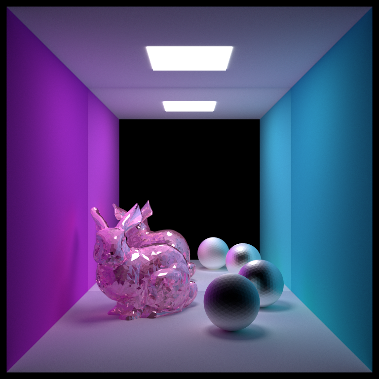

# remote-rendering
CIS-565 Final Project

NVIDIA OptiX 7.2.0 SDK & Samples: https://developer.nvidia.com/optix

NVIDIA OptiX 7 SIGGRAPH Course Samples: https://gitlab.com/ingowald/optix7course

How to Setup the OptiX samples:

Step 1: Download the NVIDIA OptiX 7.2.0 SDK from https://developer.nvidia.com/designworks/optix/download. This will require a NVIDIA Driver of version 456.71 or newer (you should be fine if you already downloaded one while setting up your environment for 565)

Step 2: Once you download the SDK, it will come with some OptiX samples under the SDK folder. Run cmake to configure and generate the VS solution (create a build dir under the SDK folder before doing this)

Step 3: Now open the build directory: there should be a OptiX-Samples.sln file. Open that in VS.

Step 4: You'll see a bunch of optix samples, the one I showed during our meeting is the optixPathTracer sample. You can set that as the startup project and run in Release mode.

Step 5: Download the OptiX 7 course samples from here: https://gitlab.com/ingowald/optix7course (or use the optix7course-master folder I put in this repo). Create a build dir and run cmake to configure. It might fail the first time, you will have to set OptiX_INCLUDE and OptiX_INSTALL_DIR manually to paths where you installed the OptiX 7.2.0 SDK.

Step 6: For the samples with sponza.obj you need to download the Crytek Sponza model from https://casual-effects.com/data/, create a models directory and unzip the sponza model download in there.
